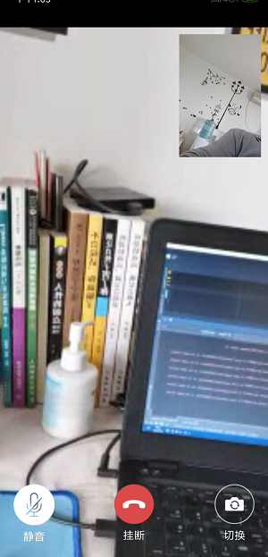
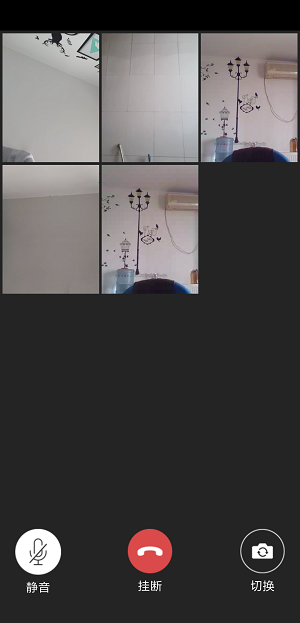
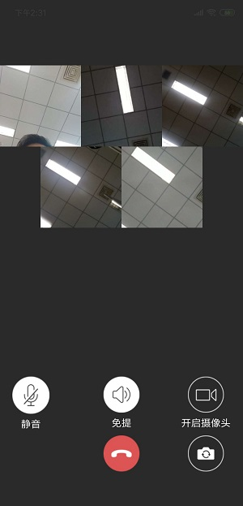

# KAndroidTemplate

<p align="center"></p>

<p align="center">
    <strong>WebRTC视频通话</strong>
    <br>
    <br>
    <a href="https://kenniecode.github.io/kennie_webrtc/">使用文档</a>
    <br>    
</p>

<p align="center">


</p>


## 简介

基于 [WebRTC](https://webrtc.googlesource.com/) 开发的一套可以进行**单路**或者**多路**语音、视频的系统。高仿微信九宫格显示，最多可支持 **9** 路视频。

如有任何疑问或者Bug，请在 github 上公开讨论[技术问题](https://github.com/kenniecode/KennieFilterMenu/issues)

**开源不易，如果喜欢的话希望给个 `Star` 或 `Fork` ^_^ ，谢谢~~**

## 功能及特点

- 支持一对一语音和视频
- 支持多对多语音和视频会议
- 灵活替换wss信令服务器和stun/turn转发穿透服务器
- 动态权限申请
- 切换摄像头、免提、开启静音、关闭视频保留声音
- 呼叫、响铃、拨打电话的整个流程
- 将信令模块和UI提取出来，将核心代码封装成SDK

## 预览

|  |  |  |
| --- | --- | --- | 
|  |  |  |

## 下载

- [GitHub下载](https://gitee.com/kenniecode/kennie-android/tree/template%2Flibrary/releases) [](https://gitee.com/kenniecode/kennie-android/tree/template%2Flibrary/releases/app-release.apk)
- 扫码


## 更新日志
- [详细日志](./docs/update_log.md)

## 注意事项

> **使用前请查看注意事项**，当前版本仅支持AndroidX

### 构建环境

> 最低支持api 21

    compileSdk 31
    minSdk 21
    targetSdk 31

> 开发环境

    AndroidStudio ArcticFox 2020.3.1 Path 3
    JDK 1.8 || JDK 11
    kotlin 1.5.31
    gradle-7.0.2-bin & gradle 7.0.3

> 运行环境

   手机端 Android7.0 ~ Android 12.0

## 赞赏
如果您喜欢KingPlayer，或感觉KingPlayer帮助到了您，可以点右上角“Star”支持一下，您的支持就是我的动力，谢谢 :smiley:<p>
您也可以扫描下面的二维码，请作者喝杯咖啡 :coffee:

| 支付宝 | 微信支付 |
|--|--|
|  |   |

## 感谢

- [AliyunGradleConfig](https://github.com/gzu-liyujiang/AliyunGradleConfig)
- [Android 代码规范文档](https://gitee.com/getActivity/AndroidCodeStandard)
- [webrtc_android](https://github.com/ddssingsong/webrtc_android)
- [webrtc网站](https://webrtc.org/)
- [WebRTC在GoogleGit上的DEMO webrtc源码编译时间：2019年4月 ](https://webrtc.googlesource.com/src/+/master/examples)
- [webrtc](https://webrtc.googlesource.com/src)
- [webrtc](https://github.com/ibaoger/webrtc)
- [webrtc目录结构](https://shimo.im/docs/DrDjcqkRYrPHy9JC/read)

## LICENSE

```
Copyright (c) 2020-2021 kennie

Licensed under the Apache License, Version 2.0 (the "License");
you may not use this file except in compliance with the License.
You may obtain a copy of the License at

   http://www.apache.org/licenses/LICENSE-2.0

Unless required by applicable law or agreed to in writing, software
distributed under the License is distributed on an "AS IS" BASIS,
WITHOUT WARRANTIES OR CONDITIONS OF ANY KIND, either express or implied.
See the License for the specific language governing permissions and
limitations under the License.
```